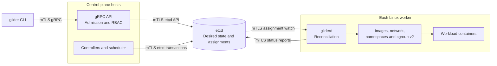

# Glider

**A distributed container platform built directly on Linux primitives.**

Glider schedules and runs OCI containers across Linux machines. Written in Go,
it implements its own runtime, image store, networking, and reconciliation
controllers using namespaces, cgroup v2, OverlayFS, VXLAN, etcd, and gRPC.
It does not wrap Docker, containerd, or Kubernetes.

[Try the demo](#try-the-demo) · [Architecture](#how-it-works) ·
[Documentation](docs/README.md) · [Roadmap](ROADMAP.md) · [MIT license](LICENSE)

> [!IMPORTANT]
> **Pre-1.0; deployment certification required.** The repository records a
> passing software qualification gate. A production deployment additionally
> requires evidence from its target environment and an independent security
> review. See [project status](#project-status-and-limits).

## Why Glider

What happens between declaring “run two replicas” and having isolated processes
serve traffic on different hosts? Glider makes that path explicit: verified
image layers become snapshots, assignments become containers, and controllers
repair differences between desired and observed state.

The project is for engineers exploring container internals, distributed
scheduling, and failure recovery. Its design documents explain the trade-offs;
its tests exercise the invariants. Start with the local control-plane demo,
then explore the Linux runtime and cluster operations.

## Try the demo

Requirements: Git, Bash, Make, and Go **1.26.6 or newer**. If Go is absent,
the demo script uses Docker with the pinned Go image instead. The first run
downloads dependencies. The native demo runs on macOS or Linux without root.

```bash
git clone https://github.com/santinomarial/Glider.git
cd Glider
make demo
```

Example success output:

```text
READY workload=api replicas=2 service=api.glider endpoints=[10.96.20.195]
ROLLOUT image=demo/api:v2 readiness-gated=true healthy-v1-preserved-until-ready=true
DEMO GREEN
```

The demo uses real embedded etcd, workload/service controllers, and scheduler
code. It supplies fixture node capacity, endpoint addresses, and health reports.
It **does not start containers, send service traffic, or exercise the gRPC API**.
The address is a service VIP in demo state, not a URL you can open in a browser.

Follow the [guided tutorial](docs/tutorials/local-demo.md) to understand each
stage, or use the [recording guide](docs/tutorials/presenting-glider.md) to
prepare a portfolio walkthrough. Actual container execution requires a Linux
host with cgroup v2; see [installation](docs/operations/install.md).

## How it works

This overview shows the operator-to-container path. Solid arrows describe
requests, writes, or local execution; the dashed arrow describes the node's
watch on assignments. etcd owns durable cluster state. Host boundaries are
shown below; registry traffic, administration, and monitoring are omitted.



Operators submit desired state through the API. The workload controller creates
replica tasks, and the scheduler atomically binds each task to a node while
reserving capacity. Each `gliderd` watches its assignments and reconciles image,
network, isolation, and process state. Observed status flows back to etcd so
controllers can gate rollouts and respond to failures.

Node leases limit execution authority. Monotonic assignment generations fence
stale reports and operations. Glider does not claim exactly-once execution
during partitions; the [failure model](docs/design/failure-model.md) explains
the boundary.

## Technical highlights

| Area | Implementation | Explore |
|---|---|---|
| Container runtime | Namespaces, `pivot_root`, cgroup v2 limits, capability reduction, seccomp, PID 1 supervision | [Runtime design](docs/design/runtime.md) |
| OCI images | Digest verification, safe layer unpacking, content-addressed storage, OverlayFS snapshots | [Image pipeline](docs/design/image-store.md) |
| Distributed control | Durable desired state, atomic scheduling, leases, fencing, replica and rollout controllers | [Architecture](docs/architecture/overview.md) |
| Networking | Bridge/veth, IPAM, DNS, NAT, VXLAN, service VIPs, stateful policy | [Network design](docs/design/networking-control-plane.md) |
| Security | Mutual TLS, RBAC, quotas, rate limits, encrypted secrets, audit events | [Control-plane security](docs/design/control-plane-security.md) |
| Operations | Authenticated node operations, backups, migrations, signed artifacts, metrics and alerts | [Operator guides](docs/README.md#operations) |

## Build and verify

The local demo is the shortest entry point. These commands provide deeper
verification and require a running Docker engine:

```bash
make docs              # Check Markdown links and render Mermaid diagrams
make test              # Build, vet, unit/race and privileged Linux runtime tests
make production-gate   # Full software qualification with an evidence bundle
```

On macOS and Windows, `make test` starts a privileged Linux container. On Linux,
the runtime harness requires root and cgroup v2. Run privileged tests only in a
disposable development environment. The production gate requires a clean
checkout and is intentionally expensive.

The full gate covers runtime isolation, admission fuzzing, repeated convergence,
backup recovery, packaged HA and upgrades, performance checks, and signed
release verification. It records the tested commit and logs in `dist/evidence`.
See [the qualification guide](docs/testing/production-gate.md) and
[performance measurement scope](docs/testing/performance.md).

## Project status and limits

- Current development version: **0.2.0-dev**. The
  [v0.1.0 audit](docs/release/v0.1.0.md) describes an earlier milestone.
- Runtime support is Linux with cgroup v2. Release tooling builds amd64 and
  arm64 artifacts; consult the [compatibility matrix](docs/release/compatibility-matrix.md).
- The operator interface is the CLI and gRPC API. A packaged
  [Grafana dashboard](packaging/monitoring/glider-dashboard.json) provides
  monitoring; a browser control console is not implemented.
- Software qualification does not certify a cluster. Multi-host availability,
  recovery, certificate renewal, monitoring delivery, and security review
  remain deployment-specific requirements under the
  [production-readiness contract](docs/release/production-readiness.md).
- Kubernetes feature parity and arbitrary kernel support are
  [explicit non-goals](docs/architecture/overview.md#7-non-goals).

## Documentation

| I want to… | Start here |
|---|---|
| Run and understand the demo | [Local tutorial](docs/tutorials/local-demo.md) |
| Present the project | [Demo and portfolio guide](docs/tutorials/presenting-glider.md) |
| Understand ownership and data flow | [Architecture map](docs/architecture/README.md) |
| Understand design choices | [Architecture decisions](docs/README.md#architecture-decisions) |
| Install and operate a cluster | [Installation](docs/operations/install.md), then [operations](docs/README.md#operations) |
| Verify a candidate release | [Software gate](docs/testing/production-gate.md) and [environment evidence](docs/release/environment-evidence.md) |
| Find a subsystem contract | [Documentation index](docs/README.md) |

## Contributing and support

See [CONTRIBUTING.md](CONTRIBUTING.md) for the development workflow and
[SUPPORT.md](SUPPORT.md) for bug reports and questions. Report suspected
vulnerabilities privately using [SECURITY.md](SECURITY.md).

## License

Glider is available under the [MIT license](LICENSE). Dependencies retain their
respective licenses.
