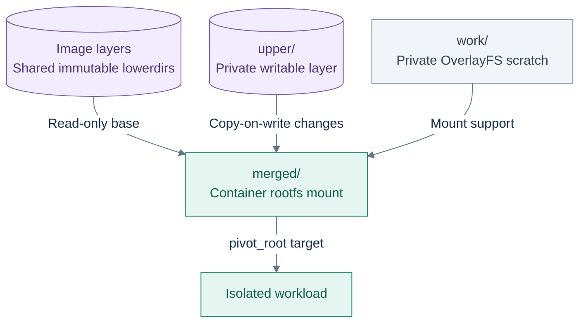

# ADR 0004: OverlayFS snapshotter

## Status

Accepted.

## Context

Each container needs a root filesystem built from immutable image layers
plus a writable per-container layer, without copying the full image per
container (master plan §15). Linux offers several union/copy-on-write
filesystem options for this: OverlayFS (mainline since 3.18, the mechanism
Docker/containerd/Podman all default to), device-mapper thin provisioning
(block-level CoW, what `devicemapper` graph driver used), Btrfs/ZFS
subvolume snapshots (filesystem-native CoW, require that filesystem as the
backing store).

## Problem

The snapshotter needs to be correct (base image immutable, one container's
writes invisible to another, correct whiteout/deletion semantics, clean
restart recovery) and needs to work as a general-purpose default without
requiring the operator to have provisioned a specific backing filesystem or
block device layout for `/var/lib/glider`.

## Decision

Use **OverlayFS** as the only snapshotter backend. Per-container layout:

**Key:** purple = persisted image or writable data; gray = private scratch; green = execution view. Arrows show mount inputs and use, not copies of whole layers. upper/ and work/ share a filesystem; their parent is per-container. The implementation uses snapshots/<container-id>/, documented in [image store](../design/image-store.md).

`lowerdir` is the (possibly multi-layer) unpacked, immutable image content
from the content store (ADR-0002); `upperdir`/`workdir` are per-container;
`merged` is what runtime.md §4's `pivot_root` step targets.

## Alternatives considered

- **Device-mapper thin provisioning.** Rejected: requires block-device/LVM
  thin-pool setup as a prerequisite, meaningfully raising the bar to run
  Glider at all (vs. OverlayFS working on an ordinary directory tree on
  virtually any Linux filesystem that supports it, which is the common
  case). More operational complexity for a benefit (finer block-level CoW
  semantics) Glider doesn't need.
- **Btrfs/ZFS subvolumes.** Rejected for the same reason: requires the
  backing store itself to be that specific filesystem, which is not a
  reasonable default requirement for `/var/lib/glider` across arbitrary
  target hosts (master plan targets modern Linux generally, not a specific
  filesystem choice).
- **Full copy per container** (no union filesystem at all — copy every
  layer's contents into a fresh directory per container). Rejected
  explicitly by master plan §15: wasteful of disk and time proportional to
  image size per container start, and sidesteps the actual systems problem
  (layered, copy-on-write filesystem construction) this phase exists to
  demonstrate.
- **Multiple pluggable snapshotter backends** (containerd's approach, which
  supports overlayfs, devicemapper, btrfs, etc. behind a common interface).
  Rejected for this project's scope: a plugin abstraction for backends
  Glider will never actually exercise is exactly the kind of premature
  generality the project's engineering guidelines (master plan §37)
  disallow — "fake interfaces with one implementation merely for style."

## Consequences

- The image/rootfs preparation path (Phase 5–7) has one concrete mechanism
  to implement and test deeply, rather than an abstraction layer over
  several.
- Hosts must have kernel OverlayFS support (standard on virtually all
  current distributions' default kernels) — consistent with the project's
  general "modern Linux kernel" baseline (ADR-0001's spirit, applied here).
- OverlayFS-specific semantics (whiteout files as character devices
  `0/0`, opaque directories via the `trusted.overlay.opaque` xattr) are the
  concrete whiteout mechanism the unpacker (Phase 6) must produce and this
  snapshotter must interpret correctly — documented in
  `docs/design/image-store.md` once Phase 5 begins.

## Risks

- OverlayFS has known limitations Glider must respect: e.g. certain
  historical kernel versions had bugs around multiple lowerdirs or opaque
  directories; the minimum kernel version Glider targets should be chosen
  with this in mind once real testing surfaces any issue (tracked as a
  Phase 7 concern, not blocking this ADR).
- No cross-filesystem xattr/permission edge cases have been validated yet —
  this ADR fixes the mechanism choice; correctness details are the
  Phase 7 design doc's job.

## What would cause reconsideration

Discovering during Phase 7 that OverlayFS cannot correctly express a
semantic Glider needs (none currently anticipated) would require revisiting
this choice. Wanting fancier snapshot/clone features (e.g. instant
container-to-image promotion) is not sufficient justification — out of
scope per master plan §36 (no checkpoint/restore-class features).
