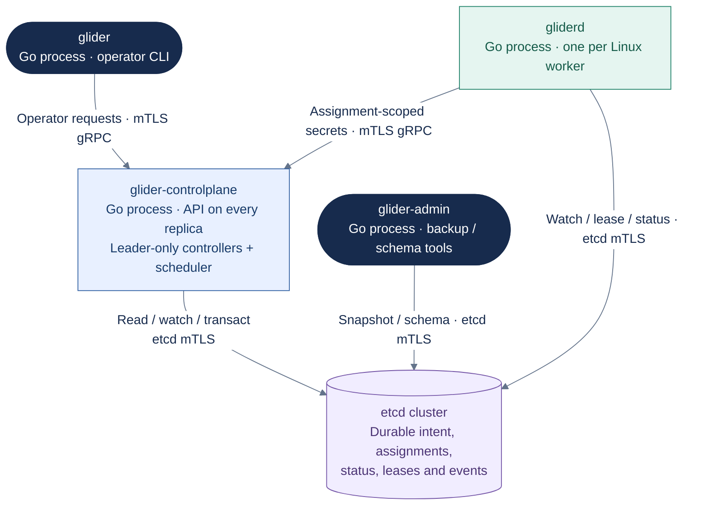
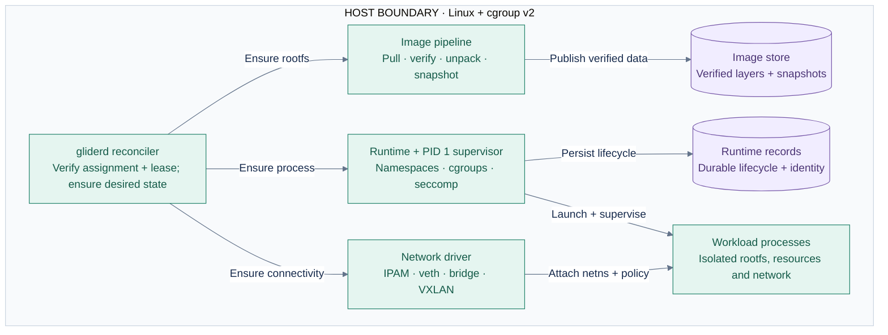

# Container view

This C4-style container view shows Glider's deployable processes and durable
stores. It answers ownership and protocol questions; package-level mechanics
remain in the linked design documents.

## Control plane and clients

This view shows executable processes and their network connections.
All API replicas accept operator requests; only the elected replica runs the
mutating controller loops. Workers maintain direct etcd sessions.

**Key:** dark = operator tools; blue = control-plane process; purple cylinder
= durable store; green = worker process. Arrows show the client initiating the
labeled connection; watch events return on that connection.
API admission, controllers, and the scheduler share one
process, not separate microservices. PKI issuance and offline restore are omitted.

## Inside a Linux worker

This component view expands `gliderd` and its runtime helpers. The node's own
state is recovery evidence; it cannot replace current etcd assignment authority.

**Key:** green = node execution; purple cylinder = persisted local data.
Solid arrows are local calls/writes. Both stores are node-local disk.
Image, network, and runtime boxes group implementation concerns,
not independent network services. Registry traffic is shown in the
[cold image flow](runtime-flows.md#cold-oci-image-to-running-process).
Authenticated node operations are described
in [their own contract](../design/node-operations.md).

## Ownership matrix

| Concern | Authoritative owner | Persistence |
|---|---|---|
| API authentication and authorization | `glider-controlplane` | Policy/config plus audit events |
| Desired workloads and services | Control-plane API and controllers | etcd |
| Task placement and generation | Scheduler CAS transaction | etcd |
| Node authority | Lease controller plus node self-fencing | etcd lease and node-local deadline |
| Container realization | `gliderd` reconciler | Node-local state, reported to etcd |
| Process and resource isolation | Glider runtime | Linux kernel plus crash-recovery record |
| Image identity | Digest-resolved image pipeline | Content-addressed node-local store |
| Service endpoints | Service controller from Ready task status | etcd; consumed by discovery/dataplane |
| Secrets at rest | Control plane with external master key material | Encrypted etcd values |

## Key invariants

1. etcd is the cluster source of truth; no process-local cache can create
   assignment authority.
2. Binding a task and reserving capacity is one compare-and-swap transaction.
3. A node acts only while its lease and assignment generation are current.
4. Reconciliation is idempotent: repeating an `Ensure*` operation does not
   create duplicate resources.
5. Desired state and observed state are stored separately; observed status
   cannot mutate intent.

Related: [runtime design](../design/runtime.md),
[image pipeline](../design/image-store.md),
[network/control-plane design](../design/networking-control-plane.md), and
[leases and reconciliation](../design/leases-overlay-workloads-health.md).
