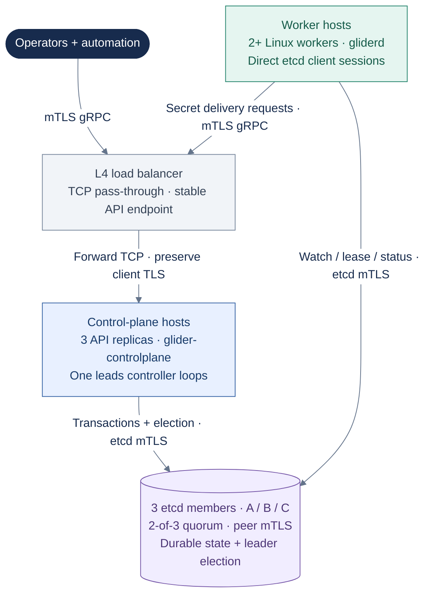
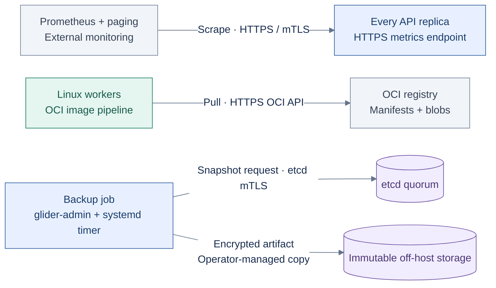

# Production deployment view

This view describes a reference topology and its failure domains.
It is a deployment model, not proof that a particular installation has passed
qualification; evidence requirements remain in
[production readiness](../release/production-readiness.md).

## Request routing and authority

Replicated groups are collapsed here so the routing stays readable. The
placement table below expands those groups across independent failure domains.

**Key:** dark = clients; gray = routing infrastructure; blue = API/controller
processes; purple cylinder = replicated durable state; green = workers. Arrows
show connection initiators. Replies and watch events return on the same
connections. The API load balancer does not proxy etcd watches or leases.

## Failure-domain placement

| Role | Domain A | Domain B | Domain C |
|---|---|---|---|
| API replica | Control plane 1 | Control plane 2 | Control plane 3 |
| Durable state | etcd member 1 | etcd member 2 | etcd member 3 |
| Workload execution | Worker 1 | Worker 2 | Optional additional workers |

Domains must correspond to independent host or infrastructure failures for
the availability claim being made. Roles in a column need not share a host.
Placing every member in one VM or one storage failure domain tests process
failover, not host availability. etcd's Raft leader and Glider's controller
leader are separate elections.

## External operations

This view isolates monitoring, image distribution, and backup dependencies
from the critical scheduling path. It shows service groups, not host placement.

**Key:** blue = operational Glider process; green = workers; gray = external
service; purple cylinder = durable storage. The backup job encrypts snapshots
locally; an independently configured job copies them off-host. Certificate
issuance and renewal apply to all authenticated endpoints and are omitted
from these paths; see [PKI](../operations/pki.md).

## Quorum and failure behavior

| Failure | Expected behavior | Qualification evidence |
|---|---|---|
| One control-plane process or host | Load balancer removes it; API remains available | Requests through the stable endpoint during termination |
| One etcd member | Two-member majority continues committing | Linearizable mutation while the member is unavailable |
| One worker | Lease expires; assignments are fenced and replaced | No stale status accepted; workloads recover within the declared SLO |
| Control-plane network partition | Only the quorum side commits; isolated authorities stop | No split scheduling authority |
| Registry outage | Cached images may start; uncached pulls fail explicitly | No unverified or partial image becomes runnable |
| Backup destination outage | Alert fires; local operation continues without claiming a valid RPO | Pager delivery and later successful immutable copy |

## Capacity floor

The baseline is three control-plane replicas, three etcd members, and at least
two workers. Production sizing must reserve host capacity for the OS, image
unpack, logs, and recovery bursts. See [capacity and sizing](../operations/sizing.md).

## Security zones

- The public or operator-facing API boundary contains only the load balancer
  and mTLS API; etcd is reachable only over restricted internal connections.
- etcd peer ports admit members only. Client access is restricted to the
  configured control-plane, worker, and administrative identities; workers
  need direct etcd connectivity in the current implementation.
- Worker nodes receive only assignment-scoped secrets for their current
  generation.
- Backup storage is a distinct failure and credential domain.
- Monitoring is read-only except for its external notification path.

Related: [high availability](../operations/high-availability.md),
[PKI](../operations/pki.md), [backup and restore](../operations/backup-restore.md),
and [environment evidence](../release/environment-evidence.md).
