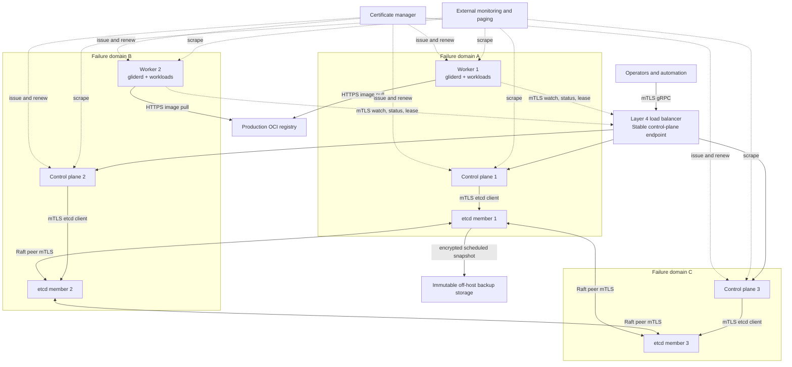

# Production deployment view

This view describes the minimum qualified topology and its failure domains.
It is a deployment model, not proof that a particular installation has passed
qualification; evidence requirements remain in
[production readiness](../release/production-readiness.md).

## Topology

The three failure-domain subgraphs must map to genuinely independent host or
infrastructure failures for the availability claim being made. Placing all
members in one VM, one host, or one non-redundant storage domain exercises
process failover but does not qualify host-level high availability.

## Quorum and failure behavior

| Failure | Expected behavior | Qualification evidence |
|---|---|---|
| One control-plane process or host | Load balancer removes it; API remains available | Requests through the stable endpoint during termination |
| One etcd member | Two-member majority continues committing | Linearizable mutation while the member is unavailable |
| One worker | Lease expires; assignments are fenced and replaced | No stale status accepted; workloads recover within the declared SLO |
| Control-plane network partition | Only the quorum side commits; isolated authorities stop | No split scheduling authority |
| Registry outage | Cached images may start; uncached pulls fail explicitly | No unverified or partial image becomes runnable |
| Backup destination outage | Alert fires; local operation continues without claiming a valid RPO | Pager delivery and later successful immutable copy |

## Capacity floor

The baseline is three control-plane replicas, three etcd members, and at least
two workers. Production sizing must reserve host capacity for the OS, image
unpack, logs, and recovery bursts. See [capacity and sizing](../operations/sizing.md).

## Security zones

- The public or operator-facing boundary terminates only at the load balancer
  and mTLS API; etcd is never an operator endpoint.
- etcd peer and client ports are restricted to control-plane identities.
- Worker nodes receive only assignment-scoped secrets for their current
  generation.
- Backup storage is a distinct failure and credential domain.
- Monitoring is read-only except for its external notification path.

Related: [high availability](../operations/high-availability.md),
[PKI](../operations/pki.md), [backup and restore](../operations/backup-restore.md),
and [environment evidence](../release/environment-evidence.md).
