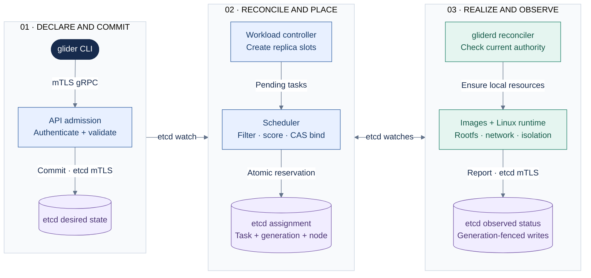
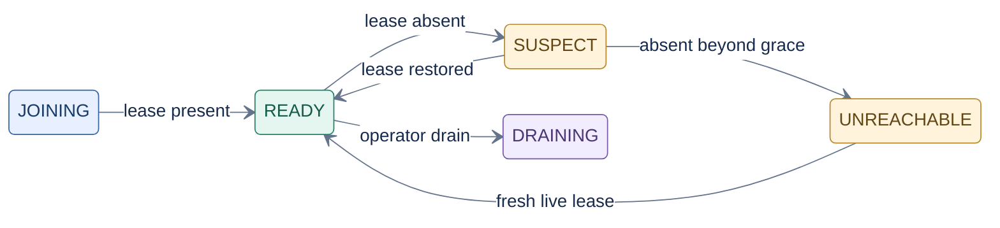
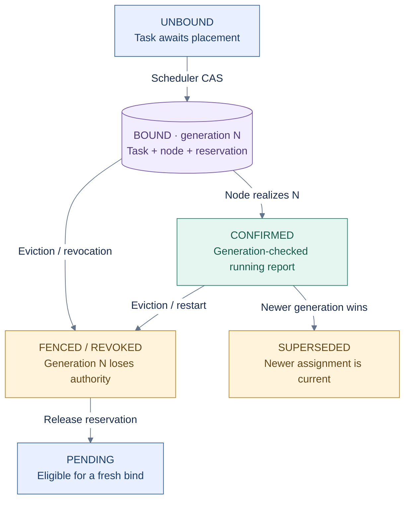

# Glider architecture overview

Status: living architecture contract.
Related: [container-lifecycle.md](../design/container-lifecycle.md),
[runtime.md](../design/runtime.md), [failure-model.md](../design/failure-model.md),
[security-model.md](../design/security-model.md).

For rendered structural and dynamic diagrams, use the
[architecture map](README.md): system context, deployable containers,
production deployment, and runtime/reconciliation flows. This page remains the
authoritative explanation of design principles, identifiers, and state-machine
semantics.

## 1. What Glider is

Glider is a distributed system for running containerized workloads across a
small cluster of Linux machines, built from Linux primitives (namespaces,
cgroup v2, OverlayFS, netlink) and a reconciliation-driven control plane
(etcd). It is scoped as a deliberately smaller, self-implemented combination
of ideas from runc, containerd, and Kubernetes — not a wrapper around any of
them.

Two binaries carry almost all of the system's behavior:

- **Control plane** (API server, scheduler, controllers) — decides *what
  should run and where*, and durably records that decision.
- **`gliderd`** (one per node) — makes the node's *actual* state match the
  control plane's *desired* state, using a self-contained runtime, image
  store, and network stack.

Everything else (CLI, client library, benchmarking/chaos harnesses) is a
consumer of these two.

## 2. Design philosophy

These principles are load-bearing — later phases are expected to violate a
naive reading of section 6 of the master plan only if this document is
updated first, via an ADR if the change is one we intend to freeze.

**Desired state, not imperative orchestration.** The control plane never
tells a node "start container X now." It records "task X should be RUNNING,
generation N" and `gliderd` reconciles toward that. There is no code path
where an imperative RPC is the sole record of an action — if it isn't in
durable desired state, it didn't happen as far as the rest of the system is
concerned.

**Idempotence.** Every operation that mutates node-local or cluster state is
expressed as `Ensure*(target_state)`, not `Do*(action)`. Calling
`EnsureContainerExists(task, generation)` twice must produce one container,
not two, whether the second call is a genuine retry, a duplicate delivery, or
a reconciliation loop re-running because it doesn't remember it already ran.

**Explicit state machines.** Container, node, task, and assignment lifecycles
are enumerated below and in `container-lifecycle.md`. No component is allowed
to infer "the container is basically running" from partial evidence; it is
either in a recorded state or it is being actively determined.

**Strong invariants.** Each subsystem's design doc states what must always be
true of a given state (e.g. "RUNNING implies the cgroup, netns, and init
process all exist and the recorded PID's start time matches"). Tests attempt
to falsify these, not just exercise the happy path.

**Crash consistency.** Every design must answer: what does this component do
if it is killed between step N and N+1? Sequencing is chosen so that a
restart can either resume, safely redo (idempotently), or safely discard
partial work — see `failure-model.md`.

**No fake exactly-once execution.** A partitioned node cannot be proven to
have stopped a process before the control plane reschedules it elsewhere.
Glider does not claim exactly-once execution. It claims: durable assignment
identity, monotonic generations, lease-bounded authority, and fencing that
rejects stale generations. See §5.4 and `failure-model.md`.

## 3. End-to-end path

**Key:** dark = operator tool; blue = control-plane work; green = node execution;
purple = durable data. Phase enclosures show processing order, not hosts.
The two-headed edge carries assignments to workers and observed status back
to controllers. The cylinders are logical records in the same etcd cluster,
not separate databases. All etcd connections use mTLS. Detailed Linux setup
ordering is in [runtime flows](runtime-flows.md).

The loop at the bottom never terminates: `gliderd` re-evaluates desired vs.
observed on every watch event and on a periodic resync, so a divergence
introduced by any failure (crash, manual `rm`, OOM kill) is corrected without
a human issuing a new imperative command.

## 4. Identifier model

| Identifier | Generated | Scope | Durable? | Format intent |
|---|---|---|---|---|
| `ClusterID` | once, at `glider cluster init` | cluster | yes | random (UUIDv4) |
| `NodeID` | once, at first `glider node join`, persisted locally before the node ever contacts the control plane | cluster | yes | random (UUIDv4) — **never** derived from hostname or IP, both of which can change or collide |
| `WorkloadID` | at workload creation | cluster | yes | random, paired with a user-chosen unique `name` (human key) |
| `TaskID` | at task creation by the workload controller | cluster | yes | `<workload-name>-<ordinal>`; identifies a replica *slot*, not a specific process |
| `(TaskID, Generation)` — assignment identity | generation increments on every new binding decision for a task | cluster | yes | `Generation` is a per-task monotonic counter; this pair is the fencing token (§5.4) |
| `ContainerID` | by `gliderd`, per launch attempt | node-local | yes (node-local disk) | `<task-id>/<generation>/<attempt>` — `attempt` increments on local restart (e.g. crash-loop) *without* a new assignment generation |
| `ImageDigest` | content hash | cluster-wide (content-addressed) | yes | `sha256:<hex>` per OCI digest spec; identity *is* the content, never reassigned |
| `RequestID` | per RPC | ephemeral | no | correlation only, not persisted as authoritative state |

The `ContainerID` hierarchy is deliberate: it lets `gliderd` distinguish "the
same assignment restarted locally after a crash" (bump `attempt`, same
`generation` — the node still owns this work) from "the control plane moved
this task elsewhere" (new `generation` — the old container must be torn down
and is no longer authoritative even if still technically running).

## 5. Control-plane state machines

These are the desired-state-side lifecycles. The container's own local
runtime lifecycle (what `gliderd` drives on a single node, including PID
reuse and crash-recovery detail) is specified separately in
[container-lifecycle.md](../design/container-lifecycle.md) because it has
enough Linux-specific nuance to deserve its own document. The two are
related but distinct: a Task can be `RUNNING` at the control-plane level
while, locally, `gliderd` is mid-way through `CREATING` a replacement
container after a crash.

### 5.1 Node lifecycle

**Key:** blue = joining; green = schedulable health; amber = lease uncertainty/loss; purple = administrative drain. Arrows show the monitor's health transitions and a common drain path, not proof of process shutdown. Drain may also be requested from other phases. Removal deletes the node record after reservation checks; it is not an automatic transition to a stored `REMOVED` phase.

- **JOINING**: node has a persisted `NodeID` and is establishing its lease
  with the control plane; not yet schedulable.
- **READY**: lease is current; scheduler may place tasks here.
- **SUSPECT**: the monitor cannot find a live lease. New placements are
  avoided; the monitor waits its configured grace period before eviction.
  The node's own self-fencing deadline is independent of this monitor grace.
- **UNREACHABLE**: the lease remained absent beyond the monitor grace.
  Its assignments are evicted and requeued (§5.4). This is an observed state;
  it is not proof the node's processes have stopped.
- **DRAINING**: operator-initiated, orthogonal to health. Existing tasks are
  rescheduled elsewhere deliberately; new placements are refused.
- **REMOVED**: retained in the API vocabulary; the current removal operation
  deletes the node record rather than persisting this phase. Rejoining nodes
  must reconcile local containers against current assignment generations
  before resuming work (self-fencing, §5.4).

The current transitions are implemented in the
[lease monitor](../../internal/lease/monitor.go). A live lease can restore
`UNREACHABLE` to `READY`; it does not restore revoked assignment authority.

### 5.2 Task lifecycle

A Task is a desired replica slot owned by the workload controller. It is
control-plane state, not a process.

```mermaid
%%{init: {"theme":"base","themeVariables":{"fontFamily":"Arial, sans-serif","fontSize":"16px","lineColor":"#64748b","primaryTextColor":"#172b4d","edgeLabelBackground":"#ffffff","clusterBkg":"#f8fafc","clusterBorder":"#cbd5e1"},"flowchart":{"curve":"basis","nodeSpacing":35,"rankSpacing":45}}}%%
stateDiagram-v2
    direction TB
    accTitle: Task slot — scheduling, restart and terminal completion
    accDescr: Binding changes pending to scheduled. Generation-checked observation promotes running. Revocation returns a slot to pending; completion records terminated.
    PENDING --> SCHEDULED: atomic bind + reservation
    SCHEDULED --> RUNNING: current generation reports running
    SCHEDULED --> PENDING: revoke assignment
    RUNNING --> PENDING: eviction or restart policy
    SCHEDULED --> TERMINATED: terminal launch result
    RUNNING --> TERMINATED: terminal completion
    class PENDING,SCHEDULED control
    class RUNNING worker
    class TERMINATED store
    classDef control fill:#e8f0ff,stroke:#3563a4,color:#183b6a
    classDef worker fill:#e5f5f0,stroke:#23836b,color:#155b49
    classDef store fill:#f1edff,stroke:#7657a8,color:#4c3575
    classDef failure fill:#fff4db,stroke:#b9892a,color:#634615
    classDef external fill:#f1f4f8,stroke:#78879c,color:#334155
```

**Key:** blue = awaiting execution; green = observed running; purple = recorded terminal result. This is the current store lifecycle, not the local container state machine. Each new bind advances the generation. Deletion is separate: it atomically removes the task/assignment and releases capacity; it does not wait in `TERMINATING` for a node acknowledgment.

A node reports observed state through generation-checked store operations.
The store validates assignment identity before changing the Task's phase;
local process existence alone cannot make a stale assignment authoritative.
`TERMINATING` remains in the API vocabulary but is not the current deletion
handshake. See [store transitions](../../internal/store/etcd/store.go).

### 5.3 Assignment lifecycle

An Assignment binds one `(TaskID, Generation)` to one `NodeID`. This is the
object the [scheduler's atomic transaction](../../internal/scheduler/controller.go)
creates together with its capacity reservation.

**Key:** these are conceptual authority labels, not stored `Assignment.Phase` enum values. Purple = durable binding; green = confirmed execution; amber = invalidated authority. A confirmed assignment stays active until revoked or superseded. Supersession does not requeue an already-bound newer generation. CAS means compare-and-swap.

Invariant: **at most one non-superseded, non-fenced generation is
authoritative per task at any moment.** This does not guarantee that an old
process has already stopped. `gliderd` must check authority before
acting (see §5.4) rather than trusting that whatever it was told to run is
still current.

### 5.4 Generations and fencing (why, briefly)

A network partition cannot be distinguished, at the moment it happens, from a
crash. If Glider reschedules a task after a lease expires, and the original
node was actually alive but partitioned, both the original node and the
replacement node might now believe they should be running the workload. This
is unavoidable in an asynchronous network with fail-stop assumptions removed
— it is not a bug to be engineered away, so Glider does not pretend
otherwise (§2.6 above).

What Glider *can* guarantee: the control plane will never accept a report
from, or a re-bind based on, a generation older than the one it already
considers current for a task. And a well-behaved node self-fences — if it
cannot renew its lease before an uncertainty deadline, it stops workloads it
holds under that lease rather than waiting to be told. This bounds the
*window* of possible double-execution to the self-fencing deadline; it does
not eliminate it. The implemented lease and recovery contracts are described
in [leases and reconciliation](../design/leases-overlay-workloads-health.md)
and the [failure model](../design/failure-model.md).

## 6. Component map

| Execution boundary | Components | Responsibility |
|---|---|---|
| `glider-controlplane` · every replica | API server | gRPC, authentication, validation and versioning |
| `glider-controlplane` · elected leader | Workload and rollout controllers | Replica slots and readiness-gated replacement |
| `glider-controlplane` · elected leader | Node and service controllers | Lease health and ready endpoint sets |
| `glider-controlplane` · elected leader | Scheduler | Filter, score and atomically bind pending tasks |
| Separate etcd cluster | Durable store | Desired state, observations, leases, transactions and watches |
| `gliderd` · each worker | Reconciler | Check assignment authority and drive idempotent Ensure operations |
| `gliderd` · each worker | Image store and snapshotter | Verified content, immutable layers and writable OverlayFS roots |
| `gliderd` and runtime helpers | Runtime and network driver | Namespaces, cgroups, security, veth/bridge, IPAM and VXLAN |

The table is an ownership map, not a call graph. etcd is a separate service,
not an embedded control-plane component. The [container view](container-view.md)
shows process connections and the worker component diagram.

Workers coordinate assignments through etcd rather than peer-to-peer agent
messages. Cross-node workload packets use the VXLAN dataplane; this is distinct
from control-plane coordination.

## 7. Non-goals

See master plan §36. Restated as an active filter for design decisions in
this repo: no CRI/CNI/Kubernetes-API compatibility, no custom Raft, no
distributed block storage, no service mesh, no autoscaling, no multi-cluster
federation, no checkpoint/restore. If a design doc in this repo starts
depending on one of these, that is a signal the doc has drifted from scope,
not that the non-goal should quietly be dropped.
