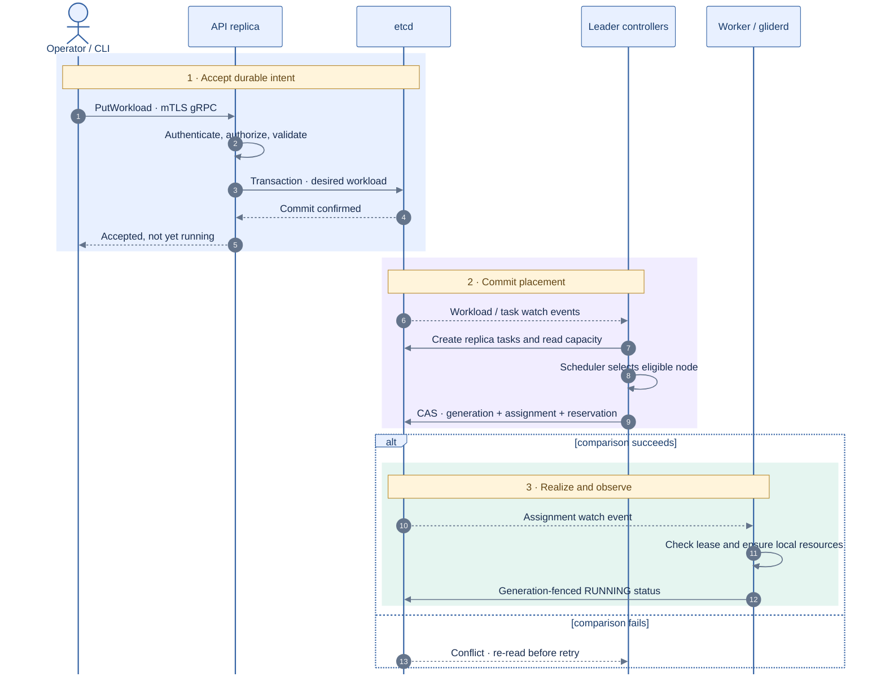
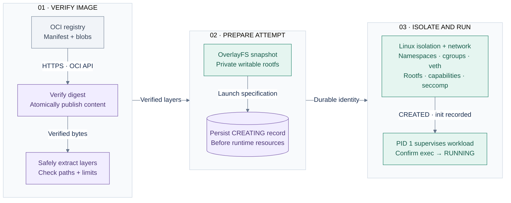
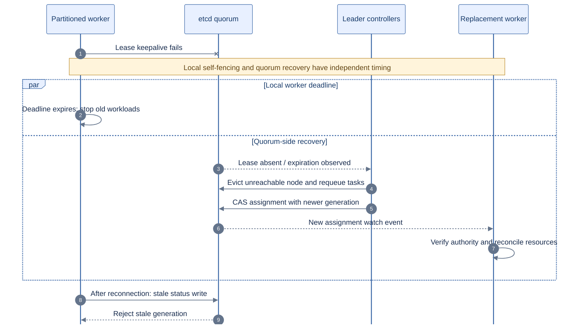
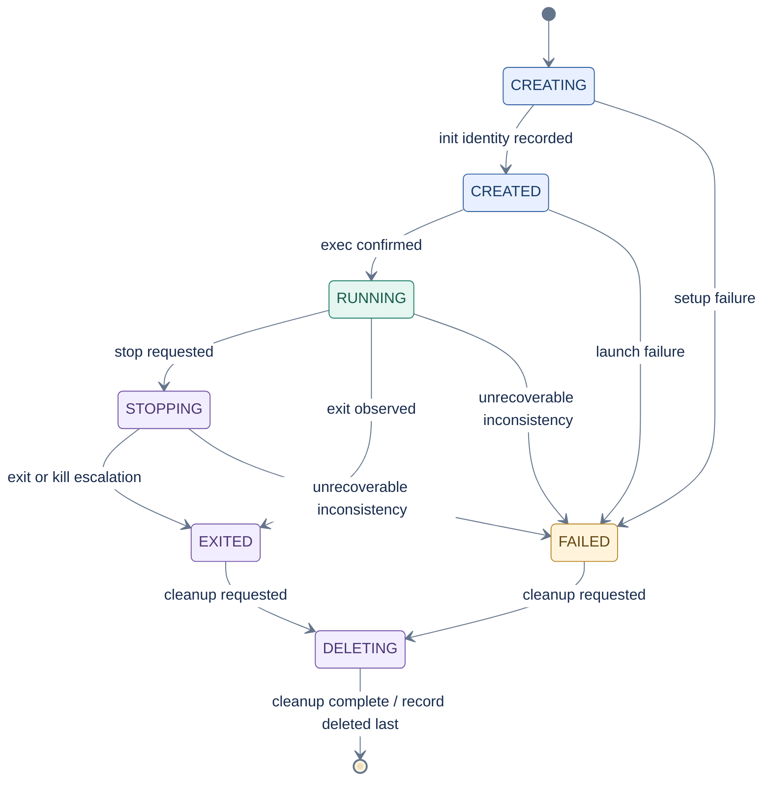

# Runtime and reconciliation flows

These dynamic views show how Glider turns declared intent into a running
container and how it withdraws stale node authority. They emphasize durable
commit points and failure handling rather than implementation call stacks.

## Workload creation and scheduling

**Key:** numbered solid messages = calls/writes; dashed messages = replies or
watch events. Shaded bands label admission, placement, and execution. All etcd
connections use mTLS in production. Leader controllers combine the workload
controller and scheduler into one participant to keep the sequence readable.

The first externally meaningful commit is the API transaction that stores
desired state. The placement commit is the scheduler CAS: task generation,
assignment, and resource reservation change atomically. `gliderd` reports
observation only; it cannot make its local process authoritative.

## Cold OCI image to running process

**Key:** gray = remote source; purple = verified/persisted data; green = node
execution. Arrows show successful artifact or control handoffs, not separate
network services. The first edge transfers registry data; later edges are local.
The phase groups describe order, not host boundaries. Failure at any stage
prevents progression; the checkpoints below describe cleanup and retry.

The content store publishes a blob only after its declared digest matches.
Layer extraction occurs into a temporary directory and becomes visible only
after success. Runtime state is written before cgroup and process setup so
crash recovery can identify partial execution. Image preparation precedes the
runtime record.

## Lease loss and generation fencing

**Key:** solid messages = calls/actions; dashed = events/replies; crossed arrow
= failed connection. The `par` lanes show independent progress, not an ordering
guarantee between old-worker shutdown and replacement start. etcd uses mTLS.

Glider does not claim instantaneous exactly-once execution across a partition.
Safety comes from monotonic generations, rejection of stale writes, and the
old node's bounded self-fencing deadline. See the
[failure model](../design/failure-model.md) for the precise guarantee.

## Local container state machine

**Key:** blue = preparation; green = executing; purple = stopping/cleanup;
amber = failure. Start/end markers mean no local record. Arrows are legal
state transitions; deleting a record is not a stored `ABSENT` phase.

`RUNNING` is valid only while the recorded process identity, namespace root,
cgroup membership, and assignment generation match. The authoritative local
transition contract is [container lifecycle](../design/container-lifecycle.md).

## Failure checkpoints

| Checkpoint | Durable evidence | Safe retry behavior |
|---|---|---|
| Before assignment CAS | Pending task | Any scheduler replica may retry |
| After assignment CAS, before node action | Assignment generation and reservation | Assigned node reconciles; scheduler does not duplicate bind |
| During image download | Temporary content file | Verify and publish, or discard partial file |
| During layer extraction | Temporary layer directory | Re-extract; immutable final layer is absent until success |
| During runtime creation | Container state record precedes resources | Recovery cleans known partial resources |
| After workload start | PID identity, start time, cgroup, generation | Reconcile verifies all evidence before retaining RUNNING |
| During termination | STOPPING/terminal record plus kernel state | Repeated stop and cleanup are idempotent |

Related: [container lifecycle](../design/container-lifecycle.md),
[image store](../design/image-store.md),
[leases and reconciliation](../design/leases-overlay-workloads-health.md), and
[ADR 0006](../adr/0006-glider-init-pid1-supervisor.md).
