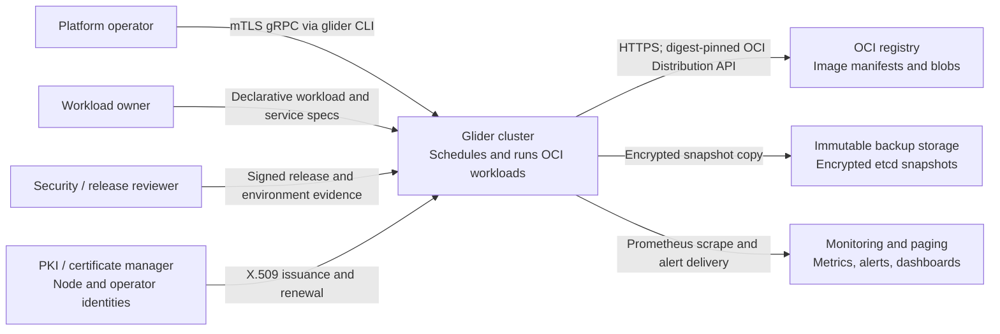

# System context

This view answers who interacts with Glider and which external systems are
inside the production dependency boundary. It deliberately hides internal
processes; see the [container view](container-view.md) to zoom in.

## Context diagram

Arrow direction shows the initiating data flow, not organizational ownership.
All administrative and node control-plane traffic is mutually authenticated.
Image content is accepted only after digest verification; backup objects are
encrypted and authenticated before leaving the cluster.

## Responsibilities

| Actor or system | Owns | Does not own |
|---|---|---|
| Platform operator | Cluster lifecycle, capacity, credentials, upgrades, incident response | Reconciliation decisions or task placement transactions |
| Workload owner | Desired workload, service, secret references, rollout intent | Direct node commands or assignment authority |
| Glider | Admission, durable desired state, scheduling, reconciliation, runtime isolation, status | Registry availability, external certificate policy, off-host storage durability |
| OCI registry | Availability of declared manifests and blobs | Trust in mutable tags; Glider resolves and verifies digests |
| PKI / certificate manager | Identity issuance, expiry, revocation policy | Glider RBAC and generation fencing |
| Backup storage | Off-host immutable retention | Snapshot correctness or restore authorization |
| Monitoring and paging | Signal retention and operator delivery | Remediation authority unless an operator explicitly automates it |

## Trust boundaries

Glider treats operator clients, nodes, and external services as separately
authenticated principals. A valid network path is not authorization. The API
enforces certificate identity and role policy; node assignment and secret
delivery additionally require the current node and task generation.

Related: [control-plane security](../design/control-plane-security.md),
[security model](../design/security-model.md), and
[production hardening](../operations/hardening.md).
