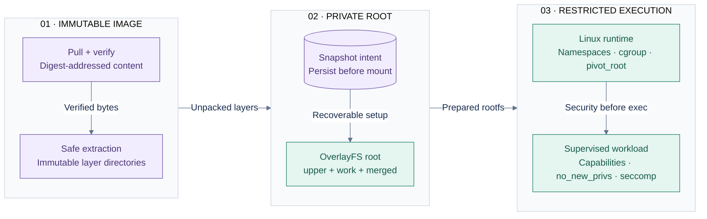

# OCI image store, layer unpacking, and OverlayFS snapshots

Status: Phases 5–7 implemented against this contract.
Related: [ADR-0002](../adr/0002-oci-image-model.md),
[ADR-0004](../adr/0004-overlayfs-snapshotter.md),
[runtime.md](runtime.md), [failure-model.md](failure-model.md).

## 1. Ownership boundaries

The image path is split into concrete packages:

| Package | Responsibility | Handoff |
|---|---|---|
| `reference/` | Normalize registry, repository, tag and digest | Validated identity |
| `registry/` | Distribution HTTP, bearer challenges, manifests and blobs | Bounded response bytes |
| `content/` | Digest verification and atomic publication | Verified content |
| `unpack/` | Safely extract untrusted tar input | Immutable layer directories |
| `snapshot/` | OverlayFS upper/work/merged lifecycle | Private writable rootfs |

`manager/` composes them for the runtime without replacing their contracts.
Unpacking consumes only verified content; snapshots consume only immutable
unpacked directories.

## 2. Reference and platform scope

Supported references are `name[:tag]` and `name@sha256:digest`. Docker Hub
short-name rules are explicit (`alpine` normalizes to
`registry-1.docker.io/library/alpine:latest`). Repository components are
validated before use in registry paths.

The registry accepts OCI and Docker schema-2 manifests/indexes and selects
`linux/amd64` only. Digest selectors and `Docker-Content-Digest` headers are
independently verified against response bytes. Bearer token realms must use
HTTPS except under explicit development-only insecure-registry mode.

## 3. Content store

Layout:

```text
content/blobs/sha256/<encoded-digest>
content/locks/sha256/<encoded-digest>.lock
```

Publication is: per-digest `flock`, same-directory temporary file, bounded
streaming hash, exact size/digest checks, file fsync, read-only mode, atomic
rename, then directory fsync. Kernel-owned locks vanish on crashes and
concurrent pulls converge. Cache hits are re-hashed; corrupt bytes are removed
and fetched again. Failed downloads never appear at the final path.

## 4. Hostile layer extraction

Layers publish at `layers/sha256/<digest>` only after complete extraction,
tree fsync, and removal of ordinary write bits. Extraction uses a random
sibling directory followed by atomic rename.

The unpacker rejects absolute, NUL-containing, overlong, or escaping paths;
symlink-parent traversal; unsafe hardlink targets; negative/truncated sizes;
configured expanded-byte/file-count overflow; device nodes; and unsupported
tar types. Regular files use exclusive creation. Symlinks are never followed.
Ownership uses `chown`/`lchown`.

OCI `.wh.<name>` entries become OverlayFS character-device `0/0` whiteouts.
`.wh..wh..opq` applies `trusted.overlay.opaque=y` to its directory. Failure to
preserve these semantics is fatal rather than silently producing a wrong image.

## 5. Snapshot lifecycle

| Path under `snapshots/<container-id>/` | Purpose |
|---|---|
| `state.json` | Durable identity, ordered layers and mount intent |
| `upper/` | Container-private writable layer |
| `work/` | OverlayFS scratch on the same filesystem as upper |
| `merged/` | Mounted rootfs passed to the runtime |

See the [OverlayFS composition diagram](../adr/0004-overlayfs-snapshotter.md#decision)
for how these paths combine with shared immutable layers.

Layers are recorded base-to-top and reversed in the OverlayFS option because
the leftmost lower directory has highest precedence. `upper` and `work` must
share a filesystem. Intent is fsynced before `mount(2)` so restart can identify
partial setup.

An existing mount is accepted only when it is OverlayFS and its record matches
the requested ID and ordered layers. A foreign mount is an ownership conflict.
Removal detaches the mount before deleting only the validated Glider-owned
snapshot path.

## 6. Runtime integration

`glider-runtime run --image <reference>` performs:



**Key:** purple = verified or durable artifacts; green = execution. Phase enclosures show handoff order, not hosts. Registry access uses HTTPS; later handoffs are local. The workload is a child of Glider's PID 1 supervisor.

With no explicit command, OCI `Entrypoint + Cmd` is used. OCI environment and
working directory are propagated, while `_GLIDER_*` control variables are
removed before execution. Exactly one of `--rootfs` and `--image` is required.
Normal completion removes the writable snapshot; immutable blobs/layers remain
reusable.

## 7. Known boundaries

- Registry credentials are injectable internally; the standalone CLI pulls
  anonymously. Node credential configuration belongs to gliderd in Phase 10.
- gzip and uncompressed tar layers are supported; zstd is not yet accepted.
- Garbage collection discovers live unpacked layers from durable snapshot
  records and fails closed if any record is corrupt. Collection is serialized
  with image preparation and snapshot removal. Unreferenced blobs and layers
  are reclaimed only after a configurable grace period, protecting recent
  downloads and avoiding churn. Blob bytes are staging data after a verified
  layer has been unpacked; active snapshots retain the unpacked layer itself.
- Explicit snapshot recovery exists. Automatic startup scanning belongs to
  persistent gliderd reconciliation in Phase 10.
